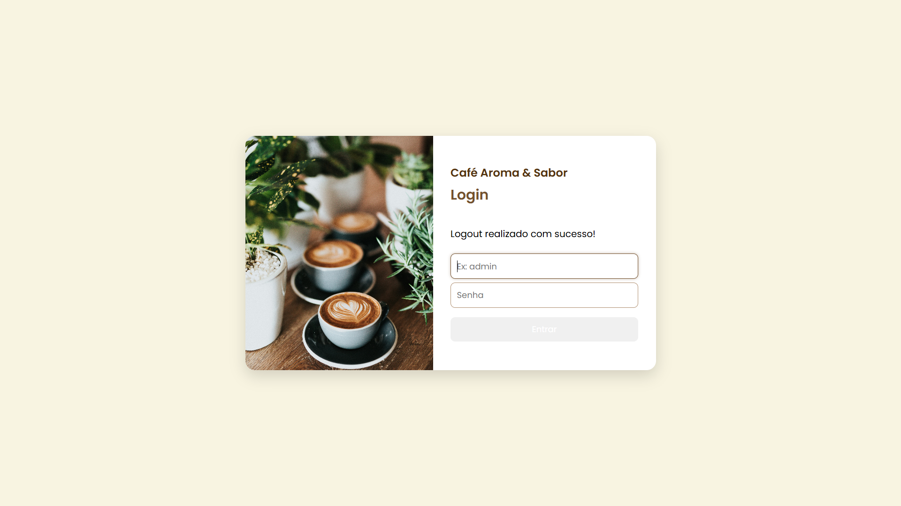
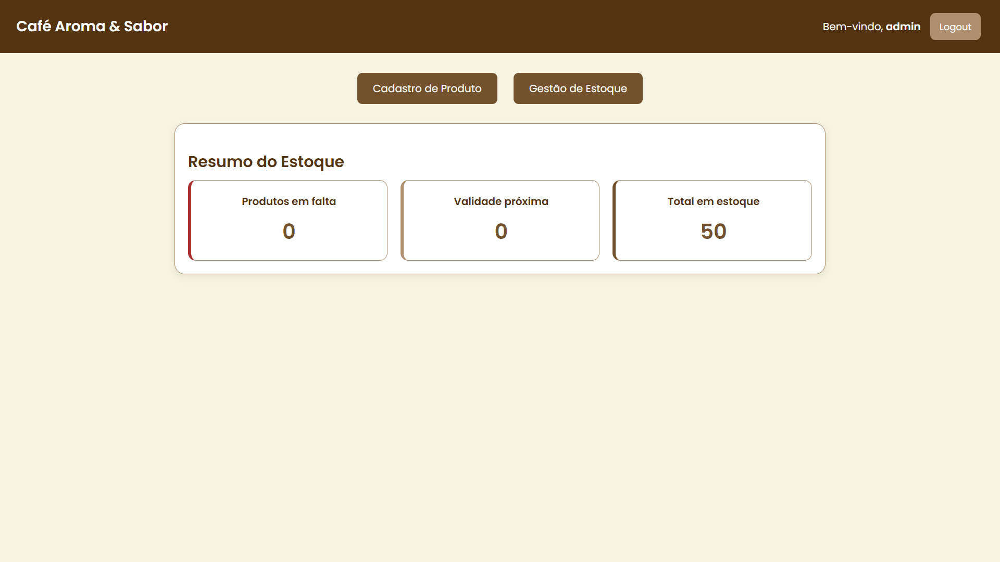
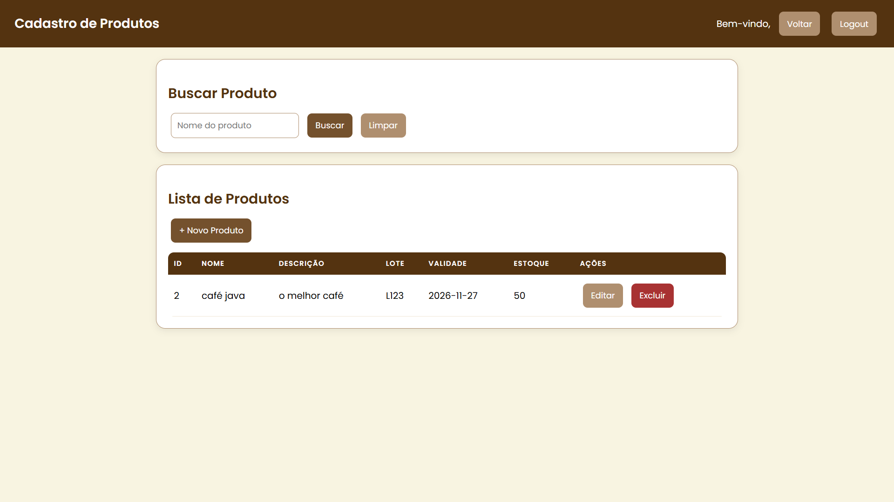
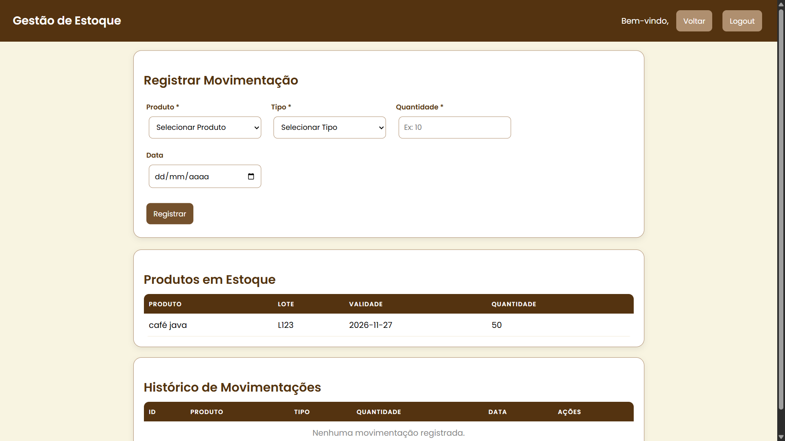

# Cafe Aroma & Sabor - Sistema de Gestao de Estoque

<p align="center">
  
  
  
  
  
  
</p>

---

## Sobre o Projeto

Sistema web completo para gerenciamento de estoque da cafeteria **Cafe Aroma & Sabor**. Desenvolvido como projeto academico no **SENAI**, permite o controle total de produtos, movimentacoes de entrada e saida, e monitoramento inteligente de itens em falta ou proximos ao vencimento.

> Sistema monolitico com arquitetura MVC, renderizacao server-side via Thymeleaf e autenticacao por formulario com Spring Security.

---

## Paleta de Cores do Site

As cores utilizadas no design do sistema foram extraidas do tema da cafeteria, remetendo aos tons de cafe e ambiente aconchegante:

<div align="center">

| Amostra | Codigo | Uso |
|---|---|---|
|  | `#543310` | Cabecalho, titulos, cabecalho de tabelas |
|  | `#74512D` | Botoes primarios, numeros do dashboard |
|  | `#AF8F6F` | Bordas, botoes secundarios |
|  | `#F8F4E1` | Fundo do site (creme) |
|  | `#a83232` | Botoes de perigo, alertas de erro |
|  | `#FFFFFF` | Fundo dos cards e sessoes |

</div>

---

## Funcionalidades

- **Autenticacao** — Login seguro com Spring Security (sessao + BCrypt)
- **Dashboard** — Painel com indicadores: produtos em falta, vencimentos proximos (30 dias) e total de itens em estoque
- **CRUD de Produtos** — Cadastro, listagem com busca por nome (case-insensitive), edicao e exclusao
- **Movimentacao de Estoque** — Registro de entradas e saidas com atualizacao automatica da quantidade e validacao de saldo negativo
- **Validacao de Dados** — Jakarta Validation em todas as entradas do usuario

---

## Preview

<h3>Tela de Login</h3>


<h3>Dashboard</h3>


<h3>Listagem de Produtos</h3>


<h3>Estoque / Movimentacoes</h3>


---

## Tecnologias

### Backend

| Tecnologia | Versao | Finalidade |
|---|---|---|
| Java | 21 | Linguagem principal |
| Spring Boot | 3.3.0 | Framework web |
| Spring MVC | 6.x | Camada REST/controllers |
| Spring Data JPA | 3.x | Persistencia / ORM |
| Hibernate | 6.x | Mapeamento objeto-relacional |
| Spring Security | 6.x | Autenticacao e autorizacao |
| Lombok | 1.18+ | Reducao de boilerplate |
| Jakarta Validation | 3.x | Validacao de beans |
| MySQL Connector/J | 8.x | Driver JDBC |

### Frontend

| Tecnologia | Finalidade |
|---|---|
| Thymeleaf | Template engine server-side |
| Thymeleaf Extras SpringSecurity6 | Integracao de seguranca nos templates |
| HTML5 + CSS3 | Estrutura e estilizacao |
| Google Fonts (Poppins) | Tipografia |

### Ferramentas

| Ferramenta | Finalidade |
|---|---|
| Maven | Gerenciamento de dependencias e build |
| Spring DevTools | Hot reload durante desenvolvimento |

---

## Pre-requisitos

Antes de iniciar, voce precisara ter instalado em sua maquina:

- [Java 21+](https://adoptium.net/)
- [Maven 3.9+](https://maven.apache.org/download.cgi)
- [MySQL 8+](https://dev.mysql.com/downloads/installer/)
- Git (opcional, para clonar o repositorio)

---

## Configuracao e Execucao

### 1. Clone o repositorio

```bash
git clone https://github.com/seu-usuario/cafe-aroma-e-sabor.git
cd cafe-aroma-e-sabor
```

### 2. Configure o banco de dados

Edite o arquivo `src/main/resources/application.properties` com suas credenciais MySQL:

```properties
spring.datasource.username=root
spring.datasource.password=sua-senha-aqui
```

O banco de dados `cafearomae_sabor` sera criado automaticamente na primeira execucao (graves a configuracao `createDatabaseIfNotExist=true` na URL JDBC).

### 3. Execute a aplicacao

```bash
mvn spring-boot:run
```

A aplicacao iniciara em `http://localhost:8080`.

### 4. Acesse o sistema

Abra o navegador e va para [http://localhost:8080](http://localhost:8080).

---

## Credenciais Padrao

```
Usuario: admin
Senha:   admin123
```

> As credenciais estao definidas em memoria no arquivo `SecurityConfig.java` com senha codificada em BCrypt.

---

## Estrutura do Projeto

```
.
+-- pom.xml
+-- src/
|   +-- main/
|   |   +-- java/sp/senai/br/cafearomae/CafeAromaESabor/
|   |   |   +-- CafeAromaESaborApplication.java          # Main class
|   |   |   +-- config/
|   |   |   |   +-- SecurityConfig.java                   # Configuracao de seguranca
|   |   |   +-- controller/
|   |   |   |   +-- HomeController.java                   # Dashboard
|   |   |   |   +-- LoginController.java                  # Autenticacao
|   |   |   |   +-- MovimentacaoController.java           # Movimentacoes de estoque
|   |   |   |   +-- ProdutoController.java                # CRUD de produtos
|   |   |   +-- model/
|   |   |   |   +-- Movimentacao.java                     # Entidade de movimentacao
|   |   |   |   +-- Produto.java                          # Entidade de produto
|   |   |   +-- repository/
|   |   |       +-- MovimentacaoRepository.java           # Repositorio de movimentacoes
|   |   |       +-- ProdutoRepository.java                # Repositorio de produtos
|   |   +-- resources/
|   |       +-- application.properties                    # Configuracoes da aplicacao
|   |       +-- static/
|   |       |   +-- style.css                             # Estilos globais
|   |       +-- templates/
|   |           +-- login.html                            # Pagina de login
|   |           +-- home.html                             # Dashboard
|   |           +-- produto/
|   |           |   +-- listagem.html                     # Listagem de produtos
|   |           |   +-- form-inserir.html                 # Cadastro de produto
|   |           |   +-- form-alterar.html                 # Edicao de produto
|   |           +-- movimentacao/
|   |               +-- estoque.html                      # Gestao de estoque
|   +-- test/
|       +-- java/sp/senai/br/cafearomae/CafeAromaESabor/
|           +-- CafeAromaESaborApplicationTests.java      # Testes
```

---

## Endpoints da API

### Autenticacao

| Metodo | Rota | Descricao |
|---|---|---|
| GET | `/login` | Exibe formulario de login |
| POST | `/login` | Processa autenticacao (Spring Security) |
| GET | `/logout` | Encerra sessao |

### Dashboard

| Metodo | Rota | Descricao |
|---|---|---|
| GET | `/home` | Painel com indicadores do estoque |

### Produtos

| Metodo | Rota | Descricao |
|---|---|---|
| GET | `/produto` | Lista todos os produtos |
| GET | `/produto/buscar?nome=` | Busca produtos por nome |
| GET | `/produto/form-inserir` | Exibe formulario de cadastro |
| POST | `/produto/salvar` | Salva novo produto |
| GET | `/produto/form-alterar/{id}` | Exibe formulario de edicao |
| POST | `/produto/atualizar` | Atualiza produto existente |
| GET | `/produto/excluir/{id}` | Exclui produto |

### Movimentacoes

| Metodo | Rota | Descricao |
|---|---|---|
| GET | `/movimentacao` | Pagina de gestao de estoque |
| POST | `/movimentacao/registrar` | Registra entrada/saida |
| GET | `/movimentacao/excluir/{id}` | Exclui movimentacao |

---

## Modelo de Dados

### Produto

| Campo | Tipo | Restricoes |
|---|---|---|
| id | Long (PK) | Auto-incremento |
| nome | String | Obrigatorio, max 150 caracteres |
| descricao | String | Opcional, max 300 caracteres |
| quantidade | Integer | Obrigatorio |
| lote | String | Opcional, max 50 caracteres |
| validade | LocalDate | Opcional |

### Movimentacao

| Campo | Tipo | Restricoes |
|---|---|---|
| id | Long (PK) | Auto-incremento |
| tipo | Enum (ENTRADA/SAIDA) | Obrigatorio |
| quantidade | Integer | Obrigatorio |
| data | LocalDate | Opcional (padrao: data atual) |
| produto | Produto (FK) | Obrigatorio, chave estrangeira |

---

## Testes

Para executar os testes automatizados:

```bash
mvn test
```

---

## Licenca

Projeto desenvolvido para fins academicos no **SENAI**. Distribuido sob licenca MIT.
